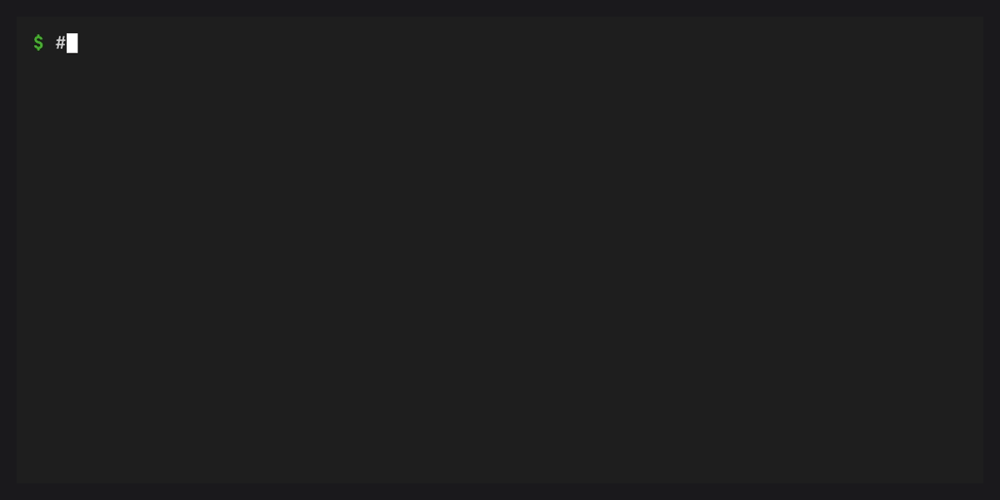

# Tasks

Tasks are named shell commands that can live alongside workspace
environment definitions or in a tasks-only manifest. They make common
project commands discoverable, composable, and repeatable through
`conda task run`.

## Task commands


A task's `cmd` can be a simple string or a list of strings joined with
spaces:

```toml
[tasks]
build = "python -m build"
build-alt = { cmd = ["python", "-m", "build", "--wheel"] }
```

## Task dependencies



Tasks can depend on other tasks. Dependencies are resolved with
topological ordering so everything runs in the right sequence:

```toml
[tasks]
compile = { cmd = "gcc -o main main.c", description = "Compile the program" }
test = { cmd = "./main --test", depends-on = ["compile"], description = "Run tests" }

[tasks.check]
depends-on = ["test", "lint"]
description = "Run all checks"
```

Running `conda task run check` resolves the full dependency graph and
runs each task in order.

## Task aliases

Tasks with no `cmd` that only list dependencies act as aliases:

```toml
[tasks.check]
depends-on = ["test", "lint", "type-check"]
description = "Run all checks"
```

## Hidden tasks

Tasks prefixed with `_` are hidden from `conda task list` but can still
be referenced as dependencies or run explicitly:

```toml
[tasks]
_setup = "mkdir -p build/"

[tasks.build]
cmd = "make"
depends-on = ["_setup"]
```

## Task arguments


Tasks can accept named arguments with optional defaults:

```toml
[tasks.test]
cmd = "pytest {{ test_path }} -v"
args = [
  { arg = "test_path", default = "tests/" },
]
description = "Run tests on a path"
```

Run with:

```bash
conda task run test src/tests/
```

## Template variables

Commands support Jinja2 templates with `conda.*` context variables:

| Variable | Description |
|---|---|
| `{{ conda.platform }}` | Current platform (e.g. `osx-arm64`) |
| `{{ conda.environment_name }}` | Name of the active conda environment |
| `{{ conda.environment.name }}` | Active environment name |
| `{{ conda.prefix }}` | Target conda environment prefix path |
| `{{ conda.version }}` | conda version |
| `{{ conda.manifest_path }}` | Path to the task file |
| `{{ conda.init_cwd }}` | Current working directory at rendering time |
| `{{ conda.is_win }}` | `True` on Windows |
| `{{ conda.is_unix }}` | `True` on non-Windows |
| `{{ conda.is_linux }}` | `True` on Linux |
| `{{ conda.is_osx }}` | `True` on macOS |

When reading from `pixi.toml`, `{{ pixi.platform }}` etc. also work as
aliases.

## Task environment variables

```toml
[tasks.test]
cmd = "pytest"
env = { PYTHONPATH = "src", DATABASE_URL = "sqlite:///test.db" }
```

## Clean environment

Run a task with only essential environment variables:

```toml
[tasks]
isolated-test = { cmd = "pytest", clean-env = true }
```

Or via CLI: `conda task run test --clean-env`

## Task caching


When `inputs` and `outputs` are specified, tasks are cached and
re-execution is skipped when inputs haven't changed:

```toml
[tasks.build]
cmd = "python -m build"
inputs = ["src/**/*.py", "pyproject.toml"]
outputs = ["dist/*.whl"]
```

:::{tip}
The cache compares SHA-256 fingerprints for declared inputs and outputs,
favoring correctness over timestamp shortcuts.
:::

## Platform-specific tasks


Override task fields per platform using the `target` key:

::::{tab-set}

:::{tab-item} TOML

```toml
[tasks]
clean = "rm -rf build/"

[target.win-64.tasks]
clean = "rd /s /q build"
```

:::

:::{tab-item} Jinja2 conditional

```toml
[tasks]
clean = "rd /s /q buildrm -rf build/"
```

:::

::::

## Task environment targeting

:::{versionchanged} 0.4.0
When a task is defined in a manifest that also declares workspace
environments, `conda task run` now falls back to the workspace's
`default` environment instead of whatever conda environment happens
to be active. Tasks without a workspace (tasks-only manifests)
still use the current conda environment. `-e <env>` and a task's
`default-environment` key continue to take precedence.
:::

Tasks defined alongside workspace environments run in the workspace's
`default` environment. Override with `-e <env>`:

```bash
conda task run test -e myenv
```

Tasks can also declare a default environment:

```toml
[tasks.test-legacy]
cmd = "pytest"
default-environment = "py38-compat"
```

## User-level tasks

Define tasks in `~/.config/conda/tasks.toml` to make them available in
every project without repeating definitions:

```toml
[tasks]
fmt = { cmd = "ruff format .", description = "Format Python files" }
clean = { cmd = "git clean -fdx -e .conda", description = "Remove untracked files" }
check = { cmd = "ruff check --fix .", description = "Lint and auto-fix" }
```

User tasks act as defaults. If a project defines a task with the same
name, the project version takes precedence. `conda task list` marks
user-sourced tasks with `(user)` so you can tell where each task comes
from:

```console
$ conda task list
  build    python -m build
  test     pytest tests/ -v
  fmt      ruff format .        (user)
  clean    git clean -fdx ...   (user)
```

User tasks work even outside a workspace. See
{ref}`User-level tasks <user-level-tasks>` for file location details and merge
semantics.
