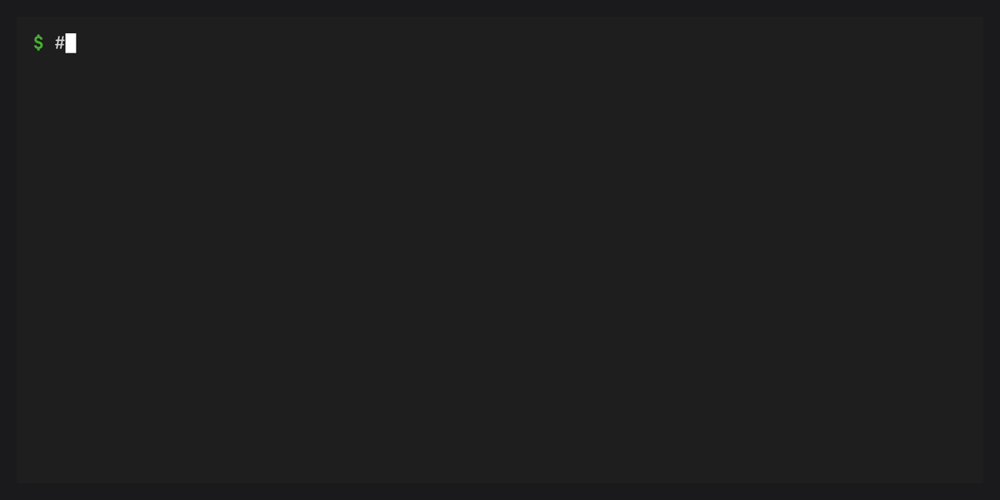

# Build a workspace image



`conda workspace image` builds one locked Linux environment and the workspace's
project files into a runnable container image. It delegates image construction
to Docker Buildx and installs packages through conda inside the Linux builder.

Install Docker with Buildx and ensure its daemon is running. Image tooling is
optional for other workspace commands and for `image --dry-run`.

## Prepare the environment

Set the workspace's `name`, declare a runtime environment and Linux platform in
the manifest, then generate `conda.lock`. The image command requires a current,
complete lockfile and never updates the source manifest or lockfile. The
workspace name must be a nonempty portable directory name without dollar signs
or apostrophes. Image environment paths have the same restriction. Conda expands
environment variables when activating a prefix, and Dockerfile parsing
interprets apostrophes in source paths. Spaces are supported.

Applications can run directly from the copied project files, for example with
`python -m myapp` or `python app.py`. Declare their runtime requirements in the
selected environment. Version-based PyPI dependencies use the existing
conda-pypi integration. Python path, Git, and URL dependencies are not supported
by the image command.

Local Python package builds are tracked in
[#178](https://github.com/conda-incubator/conda-workspaces/issues/178). They will
use the shared workspace installer once conda-pypi provides strict builds with
locked requirements and activated backends through
[conda-pypi#521](https://github.com/conda/conda-pypi/pull/521) and
[conda-pypi#523](https://github.com/conda/conda-pypi/pull/523).

The [container example](https://github.com/conda-incubator/conda-workspaces/tree/main/examples/container)
includes application source files, activation settings, and a lockfile for both
supported Linux architectures. Build it with the image command in its README.

## Build and run

```bash
conda workspace image -e runtime --platform linux-64 \
  -t myapp:latest --load -- python -m myapp

docker run --rm myapp:latest
```

Use `linux-aarch64` for ARM64. A named workspace platform that maps to either
supported subdir is also accepted. Building for another architecture requires
a builder capable of running that architecture, either natively or with
emulation.

The command after `--` becomes the image's default command. Docker command
arguments override it while preserving activation:

```bash
docker run --rm myapp:latest python -c 'import sys; print(sys.prefix)'
```

The final image contains selected project files at `/workspaces/<name>`, using
the manifest's workspace name. This is also its working directory. The selected
environment stays at `/workspaces/<name>/.conda/envs/<environment>`. Its `bin`
directory and `/workspaces/<name>/.conda/bin` are on `PATH`. The workspace's
`workspace-entrypoint` applies conda environment variables and sources activation
hooks before using `exec` to start the application. Startup performs no
installation or solving. Conda and temporary build tools are excluded unless
the selected environment or base image itself includes them.

Mount runtime data into a subdirectory, for example
`--mount type=bind,src=/path/to/data,dst=/workspaces/myapp/data` for a workspace
named `myapp`. Mounting over `/workspaces/myapp` would hide both its project
files and installed environment.

Choose a compatible glibc-based Linux base with `/bin/bash`:

```bash
conda workspace image -e runtime --platform linux-64 \
  --base-image ubuntu:24.04 -t myapp:latest --load -- python -m myapp
```

The default is `debian:bookworm-slim`. The build checks native virtual packages
against locked package and manifest requirements. The runtime host must also
meet kernel, CPU, and driver requirements. Pin base images by digest when a
stable base is required. The bootstrap image is versioned. It installs native
Linux tool dependencies separately from the locked application. The build
uses a copy of the invoking conda-workspaces Python sources and a released
conda-pypi package.

The generated recipe uses the ordinary install command for both phases,
equivalent to:

```dockerfile
RUN /opt/conda/bin/python -m conda workspace install \
    --locked -e runtime --platform linux-64 --download-only
RUN --network=none /opt/conda/bin/python -m conda workspace install \
    --locked -e runtime --platform linux-64
```

The first phase validates the lockfile and fetches its packages without
creating an environment. The second installs the locked environment with
networking disabled. The generated commands use the selected manifest, environment, and platform.
`conda_workspaces.image_entrypoint` then renders the runtime activation wrapper.

The base must not already contain the selected workspace path, such as
`/workspaces/myapp`. Other directories under `/workspaces` are allowed. This
prevents files from an earlier version of the selected workspace or environment
surviving a new build. Extend an existing workspace image with a downstream
Dockerfile.

Each invocation builds one workspace and selects one default runtime command.
Named workspace directories can coexist, each keeping its own manifest,
environment, and activation wrapper. Their task and dependency graphs remain
separate.

## Extend the image

Use the generated image in `FROM` to add files and build steps:

```dockerfile
FROM myapp:latest
WORKDIR /srv/app
COPY app.py .
RUN workspace-entrypoint python -m py_compile app.py
CMD ["python", "app.py"]
```

Ordinary commands such as `RUN python --version` find the selected environment
through `PATH`. Docker build steps do not use the image's `ENTRYPOINT`. Invoke
`workspace-entrypoint` explicitly when a build step needs manifest environment
variables or activation hooks. The derived image retains the activating
entrypoint for its runtime command. Changing `WORKDIR` changes the command's
working directory without relocating the installed environment.

For a multistage build using `COPY --from`, preserve the installed prefix's
absolute path and use a compatible Linux base. Copying `/workspaces/<name>` to
the same location includes the environment, project files, and its activation
wrapper at `/workspaces/<name>/.conda/bin/workspace-entrypoint`. Copying files
does not carry image configuration such as `PATH`, `ENTRYPOINT`, `CMD`, or
`WORKDIR`. Set those in the final stage as needed.

## Export or publish

Choose exactly one destination. `--load` loads an image into the local Docker
image store. `--push` publishes tagged images through the builder's registry
support and existing authentication:

```bash
conda workspace image -e runtime --platform linux-64 \
  -t registry.example.org/myapp:latest --push -- python -m myapp
```

`-o/--output` writes a standard OCI image layout tar archive:

```bash
conda workspace image -e runtime --platform linux-64 \
  -t myapp:latest -o myapp.oci.tar -- python -m myapp
```

The archive contains `oci-layout`, `index.json`, and content-addressed blobs.
Use an OCI-aware tool to copy or import it, for example:

```bash
skopeo copy oci-archive:myapp.oci.tar docker-daemon:myapp:latest
```

Use `--load` when loading directly into Docker, whose archive import support
varies by image store. Existing output files are never overwritten. A failed
build does not publish a partial archive.

By default the command creates a temporary `docker-container` Buildx builder
and removes it afterward. For repeated builds, reuse a builder and its cache:

```bash
docker buildx create --name workspace-images --driver docker-container
conda workspace image -e runtime --platform linux-64 \
  --builder workspace-images -t myapp:latest --load -- python -m myapp
```

An explicitly selected builder remains available after the command. OCI archive
exports require a supporting driver such as `docker-container`. See Docker's
[OCI exporter documentation](https://docs.docker.com/build/exporters/oci-docker/).

## Inspect the inputs

```bash
conda workspace image -e runtime --platform linux-64 \
  -t myapp:latest --load --dry-run --json -- python -m myapp
```

The preview includes the recipe, build package names, selected files, environment,
platform, base, tags, and destination. Successful builds return these artifact
identifiers in JSON: `environment`, `workspace`, `prefix`, `platform`,
`oci_platform`, `tags`, `output`,
`load`, `push`, `digest`, and `image_id`. Build logs go to stderr.

Project files follow the existing [archive selection rules](../features/archives.md).
Git workspaces include tracked files, plus the manifest and lockfile when
allowed by the archive filters. Required activation scripts must be included.
Ensure the selected files include the application modules used by the runtime
command.

Python path, Git, and URL dependencies, editable installs, and local conda
channels are rejected. Container configuration schemas, multi-architecture
image indexes, and task-oriented entrypoints are outside this command's
initial scope.
