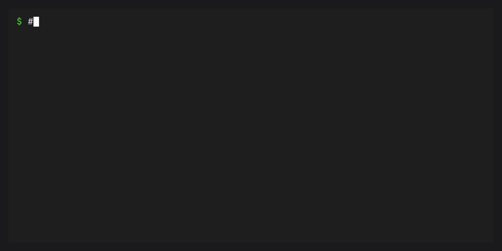
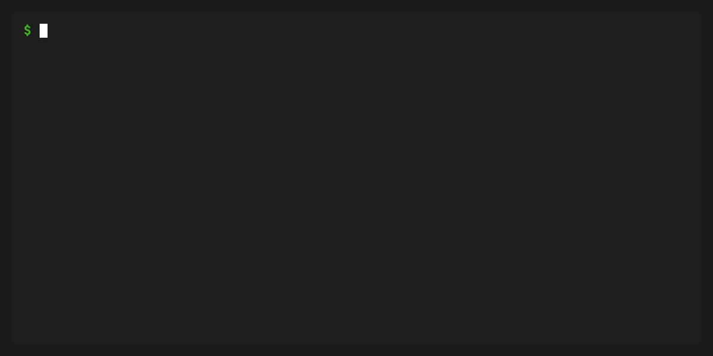

# Archives


This tutorial walks through packaging a workspace into a portable
archive and restoring it on another machine or in CI.

## Prerequisites

- conda (>= 26.3) with the conda-workspaces plugin installed
- A workspace with a manifest (`conda.toml`, `pixi.toml`, or `pyproject.toml`) and `conda.lock`

## Create a workspace archive

An archive bundles your manifest, lockfile, and source files into a
single `.tar.zst`, `.tar.gz`, or `.tar.bz2` file. In a git repo, only
tracked files are included.

```bash
conda workspace archive -o my-project.tar.zst
```

The resulting file contains everything needed to reproduce the
workspace elsewhere:

```text
my-project.tar.zst
  conda.toml
  conda.lock
  src/
    app.py
    ...
```

If no `-o` is given, the archive is named after the workspace
(`<name>.tar.zst`) and placed in the project root. The workspace name
must be a single filename segment for this default; pass `-o/--output`
when you want to write the archive somewhere else.

## Use gzip compression

For broader compatibility, use a `.tar.gz` extension:

```bash
conda workspace archive -o my-project.tar.gz
```

## Exclude files

Some files should not be included in archives. Configure permanent
exclusions in your manifest:

```toml
[workspace.archive]
exclude = ["docs/**", "*.log", "data/raw/**"]
```

Or pass one-off exclusions on the command line:

```bash
conda workspace archive --exclude "benchmarks/**" --exclude "*.csv"
```

Both sources are combined. Built-in exclusions (`.git`, `__pycache__`,
`.conda/envs`, `.pixi`) always apply regardless of configuration.

## Extract an archive

On the receiving end, extract the archive with:

```bash
conda workspace unarchive my-project.tar.zst
```

This creates a `my-project/` directory (derived from the archive
filename) containing the full workspace. To choose a different
location:

```bash
conda workspace unarchive my-project.tar.zst --target /path/to/destination
```

The target directory must be empty or absent. `unarchive` refuses to
extract over existing files.

After extraction, install the environments from the lockfile:

```bash
cd my-project
conda workspace install --locked
```

## Extract and install in one step



Pass `--install` to extract the archive and install all environments
from the lockfile in a single command:

```bash
conda workspace unarchive my-project.tar.zst --target /path/to/destination --install
```

This is equivalent to extracting, changing into the directory, and
running `conda workspace install --locked`, but without the extra steps.

## Install an environment to an explicit prefix

Use `-e/--environment` with `--prefix` to install one archived workspace
environment to a final runtime prefix:

```bash
conda workspace unarchive my-project.tar.zst \
  --target /tmp/workspace \
  --install \
  -e runtime \
  --prefix /opt/runtime
```

This extracts the workspace into `/tmp/workspace` and installs the
`runtime` environment from the lockfile directly at `/opt/runtime`.

For image builders or staged filesystem roots, add `--dest`:

```bash
conda workspace unarchive my-project.tar.zst \
  --target /tmp/workspace \
  --install \
  --dest /tmp/rootfs \
  -e runtime \
  --prefix /opt/runtime
```

With `--dest`, files are written under `/tmp/rootfs/opt/runtime`, but
the environment's final runtime prefix remains `/opt/runtime`.
`unarchive` warns if any installed files still reference the physical
staging prefix.

## Lock before archiving

If your lockfile is out of date or does not exist yet, pass `--lock`
to solve and write `conda.lock` before creating the archive:

```bash
conda workspace archive --lock
```

This is equivalent to running `conda workspace lock` followed by
`conda workspace archive`, but in a single command.

## Write a receipt for verification


Pass `--receipt` to write an external JSON receipt next to the archive:

```bash
conda workspace archive --lock --receipt -o my-project.tar.zst
```

This creates:

```text
my-project.tar.zst
my-project.tar.zst.receipt.json
```

The receipt is an in-toto Statement that records SHA-256 digests for
the archive, the manifest, and `conda.lock`, plus a per-environment
package inventory from the lockfile. Use an explicit receipt path when
your release process stores attestations separately:

```bash
conda workspace archive \
  --receipt attestations/my-project.receipt.json \
  -o dist/my-project.tar.zst
```

On the receiving side, pass `--receipt` to verify before the workspace
is moved into place:

```bash
conda workspace unarchive my-project.tar.zst --receipt --target /tmp/verified
```

Or point to the explicit receipt path:

```bash
conda workspace unarchive dist/my-project.tar.zst \
  --receipt attestations/my-project.receipt.json \
  --target /tmp/verified
```

Verified extraction checks the archive digest before extraction, then
extracts to a temporary staging directory, verifies the extracted
manifest, lockfile, and package inventory, and only then moves the
workspace to the target. The target must be empty or absent.

Receipts require both the manifest and `conda.lock` to be present in the
archive. If `include`, `exclude`, or `--exclude` filters would remove
either file, `conda workspace archive --receipt` fails before writing
the archive or receipt.

For stricter package inventory checks, require every compared package
record to include SHA-256:

```bash
conda workspace unarchive my-project.tar.zst \
  --receipt \
  --require-sha256 \
  --target /tmp/verified
```

## Bundle packages for offline use



When the target machine has no internet access, use `--bundle` to
include all resolved conda package archives (`.conda` or `.tar.bz2`)
inside the archive.

You need a lockfile first. Pass `--lock` to generate one automatically,
or run `conda workspace lock` beforehand.

```bash
conda workspace archive --lock --bundle -o my-project-offline.tar.zst
```

This adds a `packages/` directory inside the archive. Package hashes
are verified against the lockfile before bundling.

On the receiving end, `conda workspace unarchive` detects the bundled
packages, verifies their hashes, and copies them into the local conda
cache before installation:

```bash
conda workspace unarchive my-project-offline.tar.zst
# packages are primed into the conda cache automatically
cd my-project-offline
conda workspace install --locked
```

Pass `--no-install` to skip cache priming if you only want the files:

```bash
conda workspace unarchive my-project-offline.tar.zst --no-install
```

## Security

Archives are extracted with path traversal protection. Every member is
validated before extraction: absolute paths, `..` components, symlinks
escaping the target directory, and special file types (device nodes,
FIFOs) are all rejected. On Python 3.12+ the `filter="data"` parameter
provides additional defense-in-depth.

When `--bundle` is used, package hashes are verified against the
lockfile's SHA256 entries both at archive creation and at extraction.
Packages without a SHA256 entry in the lockfile are rejected instead of
being copied into the conda package cache.

### Trust model for bundled archives

A bundled archive is *self-consistent*: the package hashes match the
lockfile that ships inside the archive. However, the lockfile itself is
not externally signed. If the archive came from an untrusted source, the
lockfile inside it could have been tampered with to match altered
packages.

To guard against this:

- Obtain archives only from trusted sources.
- When possible, compare the lockfile inside the archive against a
  separately obtained copy (e.g. from version control).
- Use `conda workspace install --locked` so the solver does not
  silently add packages beyond what the lockfile specifies.

### Trust model for receipts

A receipt is an integrity record, not a signature. It can detect that an
archive, extracted manifest, extracted lockfile, or lockfile package
inventory differs from the receipt. It does not prove who created the
receipt.

For provenance-sensitive workflows, distribute the receipt through a
separate trusted channel or sign it with your release signing system.
Pair `--receipt` with `--bundle` when you want one archive to carry the
package artifacts and one sidecar receipt to bind the archive to the
lockfile inventory.

## Next steps

- {ref}`Archive configuration <archive-configuration>` for all archive settings
- {ref}`Archives <archives>` for a feature overview
- [Archive receipt reference](../reference/archive-receipts.md) for the
  receipt JSON format and verification contract
- [CLI reference](../reference/cli.md) for the full `archive` and
  `unarchive` command-line options
